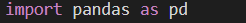

Movie\_Recommendation\_System

-----
The aim of this project is to  create a movie recommendation system using dataset from Kaggle using machine learning.

Libraries used:-

-----
- **Numpy**

**Importing Numpy Library**

**About Numpy**

Numpy is a library for the Python programming language, adding support for large, multi-dimensional arrays and matrices, along with a large collection of high-level mathematical functions to operate on these arrays.

- **Pandas**

**Importing Pandas Library**

**About Pandas**

Pandas is a Python package providing fast, flexible, and expressive data structures designed to make working with “relational” or “labeled” data both easy and intuitive. It aims to be the fundamental high-level building block for doing practical, real-world data analysis in Python.

- **Sklearn**

**Importing Sklearn**

**About Sklearn**

Scikit-learn (Sklearn) is the most useful and robust library for machine learning in Python. It provides a selection of efficient tools for machine learning and statistical modeling including classification, regression, clustering and dimensionality reduction via a consistent interface in Python. This library, which is largely written in Python, is built upon NumPy, SciPy and Matplotlib.

**Importing difflib:**

Difflib is a Python library that provides tools for comparing sequences. It is part of the standard library and can be imported using the statement import difflib.

The difflib library offers several functions for comparing sequences of elements, such as strings, lists, or files, and computing the differences between them. Some of the most commonly used functions include:

**SequenceMatcher:** This class provides a flexible way to compare sequences and compute a similarity ratio between them. It can be used to compare strings, lists, or any other sequence type. The SequenceMatcher class uses an algorithm that is similar to the Ratcliff/Obers help algorithm for computing the longest common subsequence.

**get\_close\_matches:** This function returns a list of the best matches for a given string in a list of candidates. It uses the SequenceMatcher class internally to compute the similarity ratio between the string and each candidate. The function takes several optional arguments, such as the minimum similarity ratio, the maximum number of matches, and the list of candidates.

ndiff: This function compares two sequences and returns a list of the differences between them in a human-readable format. It shows the added, removed, and modified elements of the sequences using symbols such as +, -, and ?.

**context\_diff and unified\_diff:** These functions are similar to ndiff, but they show the differences between two sequences in a context or unified format, respectively. These formats are commonly used in patch files, which are used for applying changes to code or text files.

Overall, the difflib library is a useful tool for comparing sequences and finding similarities and differences between them. It can be used in various applications, such as spell checking, text processing, version control, and data mining.

Cosine Similarity

`      `

Cosine similarity is a metric used to measure how similar the documents are irrespective of their size. Mathematically, it measures the cosine of the angle between two vectors projected in a multi-dimensional space. The cosine similarity is advantageous because even if the two similar documents are far apart by the Euclidean distance (due to the size of the document), chances are they may still be oriented closer together. The smaller the angle, higher the cosine similarity.

Getting the movie name from the user

-----
- Based on the Ratings

- Based on personal interest

Movie Recommendation:

-----
- Movie recommendation using machine learning is a popular application of machine learning that aims to predict which movies a user would like based on their previous ratings or viewing history. Here's a general approach to building a movie recommendation system using machine learning.

*LIGHTS CAMERA ACTION*

